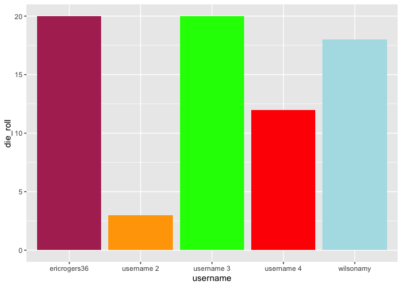
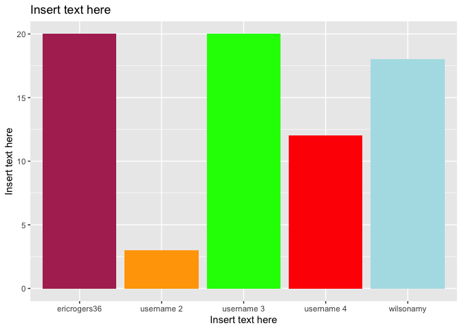
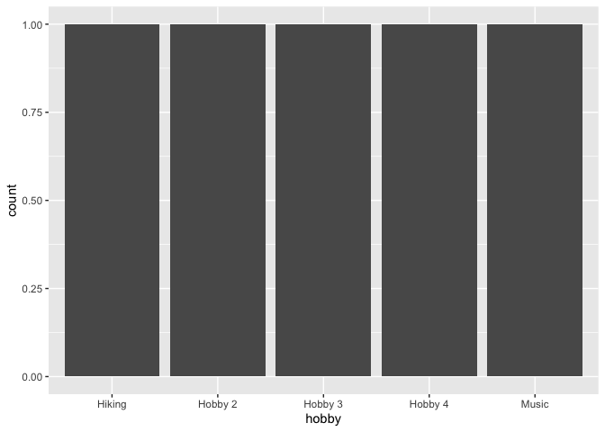

Lab 00 - Hello IDS!
================
INSERT TEAM NAME HERE
2022-09-23

### Load packages and data

``` r
library(tidyverse) 
```

### Exercises 13–17

We set up the data frame.

``` r
usernames <- c("wilsonamy", "ericrogers36", "username 2", "username 3", "username 4") #Extend if necessary
nums <- c(18, 20, 3, 20, 12) #Extend if necessary
colours <- c("powderblue", "maroon", "orange", "green", "red") #Extend if necessary
hobbies <- c("Hiking", "Music", "Hobby 2", "Hobby 3", "Hobby 4") #Extend if necessary

team_data <- tibble(username = usernames, die_roll = nums, colour = colours,
                    hobby = hobbies)
```

### Exercise 18

We now work on visualising our data.

``` r
# Uncomment the three lines below
 p1 <- ggplot(team_data, aes(x = username, y = die_roll)) +
   geom_col(fill = team_data$colour)
 p1
```

<!-- -->

### Exercise 19

This is a bar chart displaying each username with the value being the
random number that was generated and the colour of the bar being the
colour typed in.

### Exercises 20–21

``` r
# Uncomment the three lines below
 p1 +
   labs(x = "Insert text here", y = "Insert text here",
        title = "Insert text here")
```

<!-- -->

*Remove this text (including the stars), and add your answer for
Exercise 21 here.*

### Exercise 22

``` r
p2 <- ggplot(team_data, aes(x = hobby)) +
  geom_bar()
p2
```

<!-- -->

*Remove this text (including the stars) and add your answer for Exercise
22 here.*
